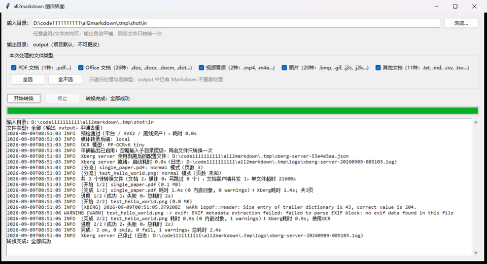

离线、基于 Rust 的快速文档转 Markdown 工具。支持 Office、PDF、图片、MP4/M4A 等 100 多种格式。

# all2markdown

## 快速开始（推荐：图形界面）

克隆仓库后，直接双击：

```bat
gui.cmd
```

界面会自动检测环境：

- 是否需要初始化
- 运行依赖是否已安装
- 缺少哪些组件（项目环境 / 依赖 / Xberg / 模型）

未就绪时点击「一键初始化」，完成后选择输入目录并点「开始转换」。整个过程不需要打开终端。



## 命令行（可选）

```bat
init.cmd
```

把文件放入 `input` 文件夹，然后运行：

```bat
all2markdown.cmd
```

转换后的 Markdown 在 `output` 文件夹中。
